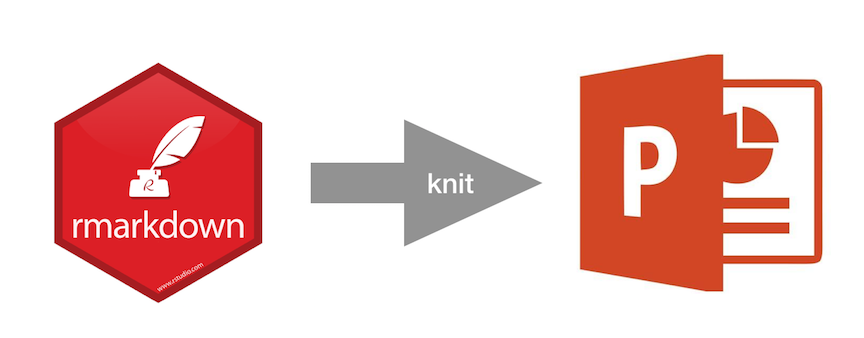

<center></center>

***

# Getting started

RStudio makes it easy to render PowerPoint presentations from [R Markdown](https://rmarkdown.rstudio.com/) documents. This capability is made possible by recent improvements to [Pandoc](http://pandoc.org/releases.html), `rmarkdown`, and the RStudio IDE.

To use all the features of RStudio with PowerPoint output, install the [RStudio Preview](https://www.rstudio.com/products/rstudio/download/preview/) which bundles Pandoc 2.x. You should also install **rmarkdown** >= v1.9.

```
devtools::install_github("rstudio/rmarkdown")
```

### New R Markdown presentation

[RStudio Preview](https://www.rstudio.com/products/rstudio/download/preview/) now offers PowerPoint as an output format for R Markdown documents:

`New File` > `R Markdown` > `Presentation` > `PowerPoint`

<center></center>


### Quick Example

To create a PowerPoint presentation from R Markdown, you specify the `powerpoint_presentation` output format in the YAML metadata of your document. 

````markdown
---
title: "Untitled"
output: powerpoint_presentation
---

`r ''````{r setup, include=FALSE}
knitr::opts_chunk$set(echo = FALSE)
```

### R Markdown

This is an R Markdown presentation. Markdown is a simple formatting syntax for authoring HTML, PDF, and MS Word documents. For more details on using R Markdown see <http://rmarkdown.rstudio.com>.

When you click the **Knit** button a document will be generated that includes both content as well as the output of any embedded R code chunks within the document.

### Slide with Bullets

- Bullet 1
- Bullet 2
- Bullet 3

### Slide with R Output

`r ''````{r cars, echo = TRUE}
summary(cars)
```

### Slide with Plot

`r ''````{r pressure}
plot(pressure)
```
````


### Knit to PowerPoint

When you knit the R Markdown document, RStudio renders your document in the PowerPoint output format. If you are using RStudio desktop, your PowerPoint presentation will automatically open and take you back to the last slide you were on. If you are using RStudio Server, you will be prompted to dowload the PowerPoint presentation.

<center></center>

You can also render files programmatically. For further details see the [Pandoc manual](http://pandoc.org/MANUAL.html).

```
> pandoc habits.txt -o habits.pptx
```

***

# Markdown features

You can generate most elements supported by Pandoc’s Markdown in PowerPoint output, such as inline formatting, lists, LaTeX math expressions, images, hyperlinks, bock quotations, etc. Additionally, the PowerPoint output format also supports these handy features:

* [Columns](#columns) (as defined in *Two Content* layout)
* [Templates](#templates) (for changing slide size and design)
* [Tables](#tables) (formatted as PowerPoint)
* [Speaker notes](#speaker-notes)

### Common markdown elements

The R Markdown output format supports most elements in the [R Markdown Reference](https://www.rstudio.com/wp-content/uploads/2015/03/rmarkdown-reference.pdf) including these commonly used elements:

```
*italics* 

**bold** 

~~strikeout~~ 

~subscipt~

^superscripts^

[small caps]{.smallcaps} 

`verbatim`

1. Numbered list

* Unnumbered list

$math-expression$

$$math-equation$$


[link](target) 

> Block quotations
```

### Columns

Create slides with two columns. Insert text and images into columns. 

```
::::::: {.columns}
::: {.column}
Column 1
:::
::: {.column}
Column 2
:::
:::::::
```

### Templates

Change the slide size or design with a reference doc when the presentation is rendered.

```
---
title: My presentation
output: 
  powerpoint_presentation:
    reference_doc: template.pptx
---
```

Any template included with a recent install of Microsoft PowerPoint (either with .pptx or .potx extension) should work, as will most templates derived from these. The specific requirement is that the template should contain the following four layouts as its first four layouts:

1. **Title**. Defined in the YAML header.
2. **Section header**. Break the presentation into sections. These slides have a section header but no content.
3. **Title and content**. Presentation content.
4. **Two Content**. Presentation content in two columns.

All templates included with a recent version of MS PowerPoint will fit these criteria. (You can click on Layout under the Home menu to check.)

You can access the default reference.pptx by running: `pandoc --print-default-data-file reference.pptx > custom-reference.pptx`

### Tables

Create native PowerPoint tables that recognize PowerPoint table designs.

```
 manufacturer    displ   hwy     class
-------------    ------  -----  ---------
        audi     1.8     29      compact
   chevrolet     5.3     20        suv
       dodge     2.4     24      minivan
```

### Speaker notes

Add speaker notes to title and content slides.

```
::: notes
These are speaker notes for a slide
:::
```

***

# Structuring the presentation

### Slide types

1. **Title**. Defined in the YAML header.
2. **Section header**. Break the presentation into sections. These slides have a section header but no content.
3. **Title and content**. Presentation content.
4. **Two Content**. Presentation content in two columns.

By default, the slide level is the highest header level in the hierarchy that is followed immediately by content, and not another header, somewhere in the document. Override using the `slide-level` option. For details, see *Structuring the Slide Show* in the [Pandoc Manual](http://pandoc.org/MANUAL.html).

The document is carved up into slides according to the following rules:

* A horizontal rule always starts a new slide
* A header at the slide level always starts a new slide
* Headers below the slide level in the hierarchy create headers within a slide
* Headers above the slide level in the hierarchy create *section headers*
* A title page is constructed automatically from the document’s title block

### Example

In this example, the default slide level would be 1, because content exists after the section header. We can define the slide level as 3 in order to render the section header properly. Note that the comment "By default..." will render as a separate slide, because section headers only have a title, but not content.

```
---
output: 
  powerpoint_presentation:
    slide_level: 3
---

# Section Header
By default, content here would normally set this as the slide level 

### Title and Content Slide
The override sets this as the new slide level

#### Bold text
Text
```

***

# Using R Code Chunks

Include code, images, and tables using R code chunks. See [R Code Chunks](https://rmarkdown.rstudio.com/authoring_rcodechunks.html) for more information.

### Tables with R

Include tables with R.

```
knitr::kable(head(iris, 8))
```

### Static visualizations

Include visualizations with R.

```
ggplot(data = mpg, mapping = aes(x = displ, y = hwy)) + 
  geom_point(mapping = aes(color = class)) + 
  geom_smooth(method = "loess")
```

### Interactive visualizations

Capture [HTML Widgets](http://www.htmlwidgets.org/) and [Shiny apps](http://shiny.rstudio.com/) with the `webshot` package.

```
install.packages("webshot")
webshot::install_phantomjs()
```

The `webshot` package will automatically take a screenshot of an interactive HTML Widget and insert it into your presentation.

```
dygraph(nhtemp, main = "New Haven Temperatures") %>% 
  dyRangeSelector(dateWindow = c("1920-01-01", "1960-01-01"))
```

You can take a screenshot of a Shiny app and include it in your presentation. Viewers can click the image in PowerPoint to link back to the hosted app online.

```
knitr::include_app('https://gallery.shinyapps.io/goog-trend-index/')
```

### Useful code chunk options

These code chunk options can be useful when rendering PowerPoint output. 

* `cache`. Save time by caching plots and other output.
* `screenshot.opts`. Allow apps to load before taking a screenshot.
* `fig.cap`. Add a caption to an image.

```
{cache=TRUE, screenshot.opts=list(delay=1), fig.cap="caption"}
```

***

# Reference

**Getting help**

* [R Markdown: The Definitive Guide](https://bookdown.org/yihui/rmarkdown/powerpoint-presentation.html)
* [Authoring Basics](https://rmarkdown.rstudio.com/authoring_basics.html)
* [Authoring Pandoc Markdown](https://rmarkdown.rstudio.com/authoring_pandoc_markdown.html)
* [R Code Chunks](https://rmarkdown.rstudio.com/authoring_rcodechunks.html)
* [Pandoc Manual](http://pandoc.org/MANUAL.html)

[Examples](https://github.com/sol-eng/powerpoint)

[Submit an issues](https://github.com/rstudio/rmarkdown/issues)
