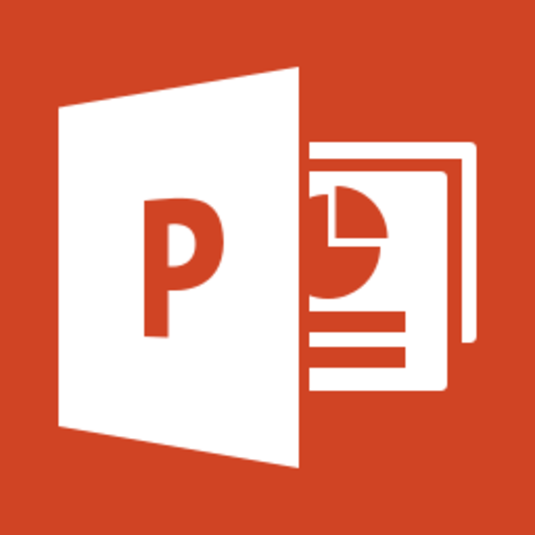
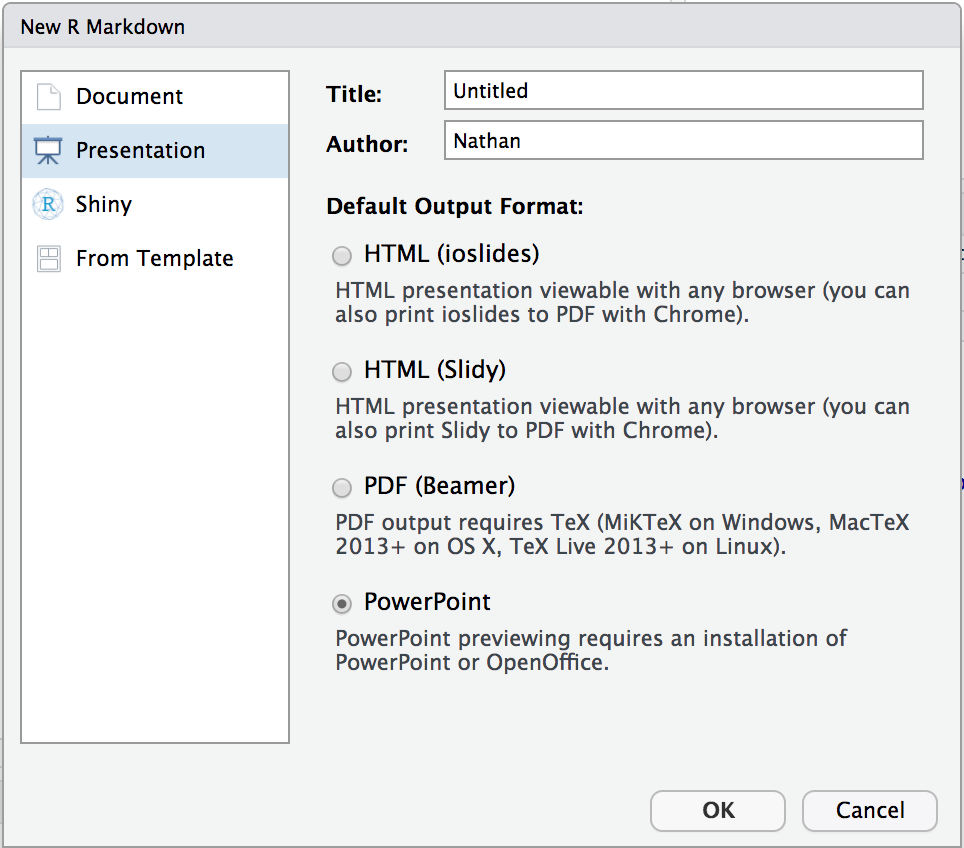

# Why would you want to create a PowerPoint presentation from R Markdown?

## Everyone knows PowerPoint

:::::::::::::: {.columns}
::: {.column}
### Standard communication tool

* Especially in business
* People "speak" PowerPoint
* Bullet points

### It's useful -- it works

* Flexible enough to get the job done
* You can make the slides fast or pretty

### Everyone has personal experience with it

* Some love it
* Others hate it
:::
::: {.column}

:::
::::::::::::::

## Anyone can learn R Markdown

:::::::::::::: {.columns}
::: {.column}
### It is so easy!

### And you can use R!

* Visualizations, tables, code, etc.

### Plain text

* Versioned, reproducible, collaborative

### Emits multiple output

* HTML, PDF, Microsoft Word
* but not PowerPoint ... UNTIL NOW!
:::
::: {.column}

:::
::::::::::::::

## We are combining two great things

# Demo: Create a PowerPoint Presentation with RStudio

## Quick Example

:::::::::::::: {.columns}
::: {.column}
Create a new R Markdown Document:

* `File > New File > R Markdown > Presentation`

Then choose:

* `Knit to PowerPoint`

Open the presentation:

* RStudio Desktop -- Opens automatically
* RStudio Server -- Downloads automatically
* *You will need PowerPoint on your workstation*
:::
::: {.column}

:::
::::::::::::::

# How does it work?

## R Markdown > Markdown > Powerpoint

## Pandoc

:::::::::::::: {.columns}
::: {.column}
What is Pandoc?

* Document converter (e.g. Markdown to HTML)
* Free software Bundled in RStudio IDE

PowerPoint output added:

* December 2017 - April 2018
* Jesse Rosenthal, *Johns Hopkins University*

Pandoc 2.2 Features:

* Markdown features
* Templates
* Columns
* Speaker Notes
* Images and Table

:::
::: {.column}

:::
::::::::::::::

## RStudio enchancements

:::::::::::::: {.columns}
::: {.column}
RStudio IDE

* Default template: `File > New File > R Markdown`
* Knit to PowerPoint
* Open to working slide (desktop only)

Code chunks

* Includes tables and plots (e.g. ggplot)
* Include webshots of HTML widgets and shiny apps

Render programmatically

* *IDE not required*
* `rmarkdown::render("in.Rmd", output_format = "powerpoint_presentation")`
:::
::: {.column}

:::
::::::::::::::

## Use cases

Render output and customize slides

* Output visualizations of your analysis
* Output ggplot
* Create webshots of shiny

Programmatically render output and distribute

* Weekly report

## Using

### See: `rendering-powerpoint.Rmd`

### Demo examples and show tutorial

### Where to get help?

### Support.rstudio.com

### rmarkdown.rstudio.com?

### github repos

### Publish to RSC
