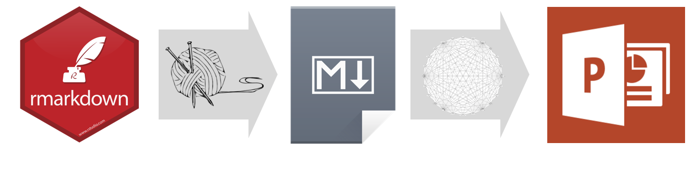
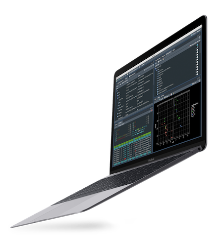
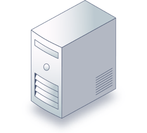
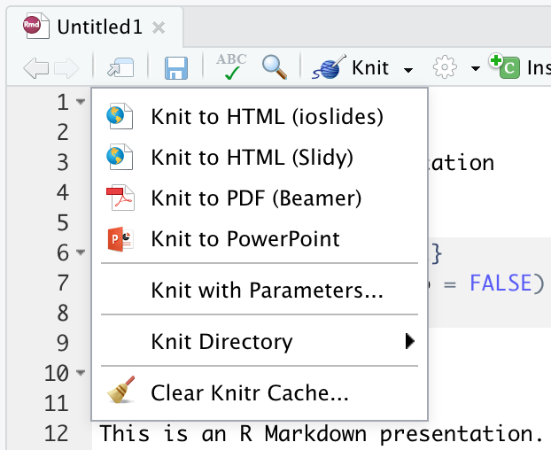
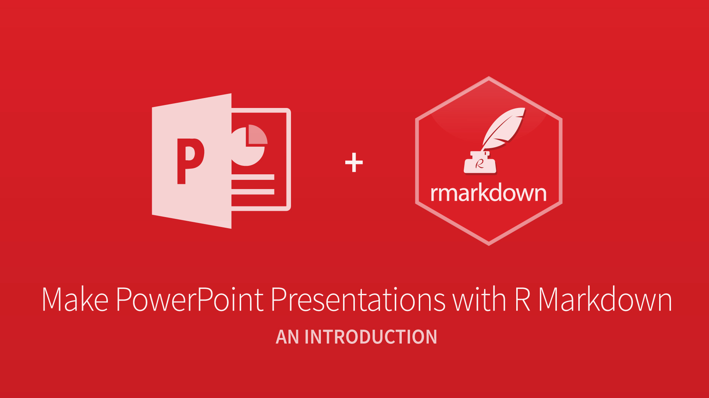

# Why would you want to create a PowerPoint presentation from R Markdown?

## Everyone knows PowerPoint

:::::::::::::: {.columns}
::: {.column}
### Standard communication tool

* Especially in business
* People "speak" PowerPoint

### It's useful -- it works

* Flexible enough to get the job done
* You can make slides fast

### Everyone has personal experience with it

:::
::: {.column}

:::
::::::::::::::

## But your work is coded in R

:::::::::::::: {.columns}
::: {.column}

### Your code is your product

* Your output is a manifestation of your code
* Plots, tables, model output, etc.

### R Markdown makes your work reproducible

* Weave text and code to produce elegantly formatted output
* Use R Notebook mode for interactive analysis

### Choose your output format

* Reports, apps, dashboards, HTML, PDF, Word,
* but not PowerPoint ... UNTIL NOW!

:::
::: {.column}

:::
::::::::::::::

## Make PowerPoint presentations with R&nbsp;Markdown.

# Demo: Create a PowerPoint Presentation with RStudio

## Quick Example

:::::::::::::: {.columns}
::: {.column}
Create a new R Markdown Document:

* `File > New File > R Markdown > Presentation`

Then choose:

* `Knit to PowerPoint`

Open the presentation:

* RStudio Desktop -- Opens automatically
* RStudio Server -- Downloads automatically
* *You will need PowerPoint on your workstation*

Render programmatically

* *IDE not required*
* `rmarkdown::render("in.Rmd", output_format = "powerpoint_presentation")`

:::
::: {.column}

:::
::::::::::::::

## Benefits of using R Markdown

:::::::::::::: {.columns}
::: {.column}

[R For Data Science](https://r4ds.had.co.nz/r-markdown.html)

* Communicating to decision makers
* Collaborating with other data scientists
* An environment in which you *do* data science

Spend less time iterating on presentation slides and more time doing better data science

:::
::: {.column}

:::
::::::::::::::

# How does it work?

## R Markdown > Markdown > PowerPoint

## Pandoc

:::::::::::::: {.columns}
::: {.column}
What is Pandoc?

* Open source software
* Convert files from one format to another
* A swiss army knife

PowerPoint output added in Pandoc 2

* Initial release in December 2017

Pandoc is bundled with RStudio

* Included in upcoming [RStudio IDE v1.2](https://blog.rstudio.com/2018/11/19/rstudio-1-2-preview-the-little-things/)
* Included in [RStudio Connect](https://www.rstudio.com/products/connect/) as of v1.6.4

:::
::: {.column}

:::
::::::::::::::

## Other options

These popular R packages offer fine grain functions for creating PowerPoint presentations.

* ReportRs
* OfficeR
* R2PPT
* Displayr

# Use Cases

## 1. Render presentation then customize

:::::::::::::: {.columns}
::: {.column}
* Output text, tables, and plots to PowerPoint
* Modify and/or copy slides into your final presentation
* [Example](../examples/bank/bank-marketing.pptx)
:::
::: {.column}

:::
::::::::::::::

## 2. Publish RStudio Connect

:::::::::::::: {.columns}
::: {.column}
* [RStudio Connect](https://www.rstudio.com/products/connect/)
    * Publishing platform for R
    * Runs your R code
    * Share Shiny apps, R Markdown reports, and much more
* Output entire presentations with R Markdown
    * Render programmatically on schedule
    * Distribute via email
    * Accept user input
    * [Example](../examples/stocks/stocks.pptx)
:::
::: {.column}

:::
::::::::::::::

# Features

## Markdown features

:::::::::::::: {.columns}
::: {.column}
* Most markdown elements
    * Text formats
    * Lists
    * Math expressions
    * Hyperlinks
* As well as these nifty features
    * Images and tables with captions
    * Speaker notes
    * Templates
* [Example](../examples/markdown/markdown-features.pptx)
:::
::: {.column}

:::
::::::::::::::

## Supports R Code (of course!)

:::::::::::::: {.columns}
::: {.column}
* Code syntax highlighting
* Table output
* Plots (e.g ggplot)
* HTML Widgets
* [Example](../examples/rcode/rcode.pptx)
:::
::: {.column}

:::
::::::::::::::

## Shiny

:::::::::::::: {.columns}
::: {.column}
Point viewers to your Shiny app

* Install `webshot` package
* Install phanotmjs: `webshot::install_phantomjs()`
* Call `knitr::include_app()`

A linked image of your app will be included in your presentation

* [Example](http://colorado.rstudio.com/rsc/tracker-app/)
:::
::: {.column}

:::
::::::::::::::

# Resources

## Where to get help

:::::::::::::: {.columns}
::: {.column}
* [rmarkdown.rstudio.com](https://rmarkdown.rstudio.com/)
* [R Markdown: The Definitive Guide](https://bookdown.org/yihui/rmarkdown/powerpoint-presentation.html)
* [Getting started](https://support.rstudio.com/hc/en-us/articles/360004672913-Rendering-PowerPoint-Presentations-with-RStudio)
* [Troubleshooting](https://support.rstudio.com/hc/en-us/articles/360006283914)
* [community.rstudio.com](https://community.rstudio.com/)
* [Submitting issues](https://github.com/rstudio/rmarkdown/issues)
:::
::: {.column}

:::
::::::::::::::

## Frequently asked questions

:::::::::::::: {.columns}
::: {.column}
* [Getting started](https://support.rstudio.com/hc/en-us/articles/360004672913-Rendering-PowerPoint-Presentations-with-RStudio)
    * How do I use custom templates?
    * How do I structure my presentation?
* [Troubleshooting](https://support.rstudio.com/hc/en-us/articles/360006283914)
    * Why does my presentation not open properly?
    * How do I put an image and text on the same slide?
    * How do I control the placement of images and text?
:::
::: {.column}

:::
::::::::::::::

## Vignettes

:::::::::::::: {.columns}
::: {.column}
[github.com/sol-eng/powerpoint](https://github.com/sol-eng/powerpoint)

* [Getting Started](../vignettes/1-getting-started.pptx)
* [Markdown Features](../vignettes/2a-markdown-features.pptx)
* [Images and Tables](../vignettes/2b-images-and-tables.pptx)
* [Columns and Notes](../vignettes/2c-columns-and-notes.pptx)
* [Templates](../vignettes/2d-templates.pptx)
* [Structuring the Presentation](../vignettes/3-structuring-the-presentation.pptx)
* [R Code Chunks](../vignettes/4-r-code-chunks.pptx)
:::
::: {.column}

:::
::::::::::::::

## Try out the new [RStudio v1.2 Preview](https://www.rstudio.com/products/rstudio/download/preview/)

## Thank you

